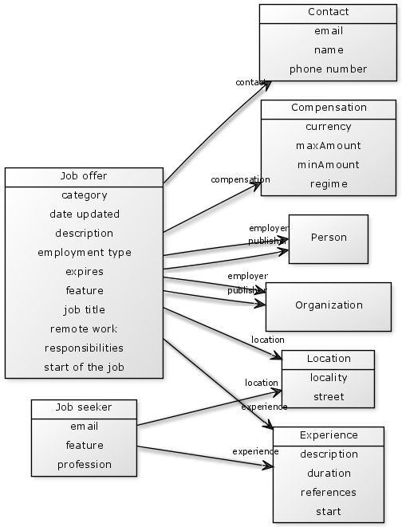
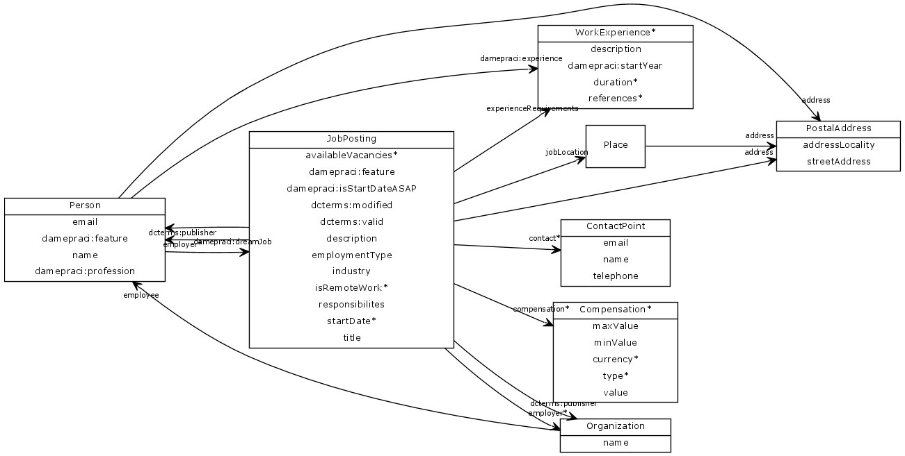

data-modelling
==============

Collection of data modelling patterns for job postings based on [Schema.org](http://schema.org).

Dependencies
------------

* [Schema.org](http://schema.org): mainly [`schema:JobPosting`](http://schema.org/JobPosting), [`schema:Person`](http://schema.org/Person)

Data model
----------

Implementation
--------------

[Schema.org](http://schema.org) is the default namespace. Vocabulary terms marked with * come from a [Schema.org extension proposal](schemaExt.ttl).

Licence
-------

This work is licensed under a [Creative Commons Attribution-ShareAlike 3.0 Czech Republic License](http://creativecommons.org/licenses/by-sa/3.0/cz/), which complies with the [licence of Schema.org](http://schema.org/docs/terms.html).
